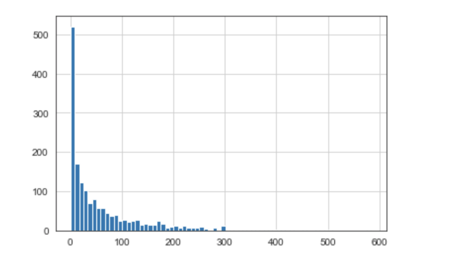
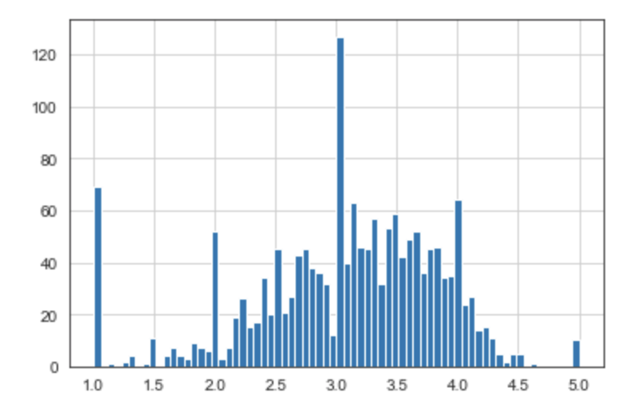
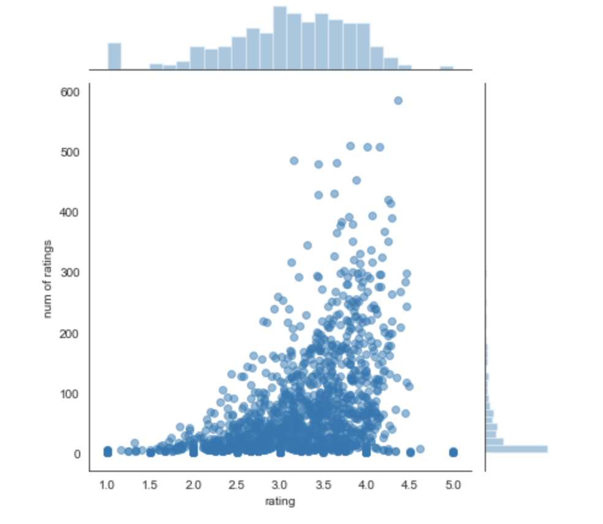

# Recommendation_Systems
 This Poject documents the different types of Recommendation Systems Developed using python.

 
- Recommended Reading Text: **Recommender Systems by Jannach and Zanker**.It is a great textbook on this topic if you want to get a deeper understanding of recommender systems.

**A fully developed and deployed recommendation systems are extremely complex and resource intensive**.

## Two recomendation Sysetems Projects are Documented
- Recommender Systems with Python: This a simplified version demonstrating the various steps to build recommendation systems in python
- Advanced Recommmender Systems with Python: This docucments a more complex and advanced approach to building recommender system including the mathematics (advanced linear algebra).

## Background
There are two most common types of recommender systems
- **Collaborative filtering**: which produces recommendations based on the knowledge of users attitude to items (i.e it uses the wisdom of the crowd to recommend items). A good example of this is **Amazon** which recommends items based on other peoples shopping experience.

- **Content-based**: which produces recommendation based on the attributes of the items and similarities between them.

**Generally speaking, the collaboratively filtering (CF) is most commonly used because it gives better results and it is relatively easy to understand**. It also have the ability to do feature learning on its own by learning for itself what features to use when recommending items.

## Collaborative Filtering (CF) can be divided into two:
- Memory-Based Collaborative Filtering by **computing cosine similarity** and 
- Model-Based Collaborative Filtering which uses **Singular Value Decomposition (SVD)**.

## Project: Movie Recommender System with Python. 
This projects created a content based recommender system for a data set of movies called the **movie lense data set** to provide movie recommendation based on the similarity of movies.

## EDA

- Number of Movie Ratings

- From the graph it looks like majority of the movie have zero rating

- Movie Ratings 

- When we visual the rating distribution itself, notice that there seems to be a peak associated with the whole numbers 1.0, 2.0, 3.0, 4.0 and 5.0 which kind of makes sense because that's the way people are going to rate movies and these movies probably have few people watching them.
- Secondly it looks like most movies are normally distributed around 3 stars.
- And there are a number of outliers around 1.0 which may explain reviews for bad movies and perhaps they are watched by few people who rated it just 1 star.

- JointPlots: Number of Movie Rating vs Rating

- From the jointplot it looks like as you get more data, you are normally likely to get a higher rating of a movie.
- This kind of make sense because, if a movie is good the more people are going to watch it and the more likely you are going to have a higher number of people reviewing or rating the movie.

- [See Project Notebook in Recommendation Systems for Code Documentation]

## Advanced Recommendation Systems with Python:

### References and Recommendations:

If yopu want to practice more on recommendation system analysis, check out these data set. Note, some of these files are quite large in most cases, not all the links may stay up to host the data, but majority of them still work or just google for your own data set.

#### Movie Recommendation:

- [Yahoo! - Movie, Music and Images Rating Data Sets](https://webscope.sandbox.yahoo.com/catalog.php?datatype=r&guccounter=1&guce_referrer=aHR0cDovL2xvY2FsaG9zdDo4ODg4L25vdGVib29rcy9NeURhdGFfU2NpZW5jZV9Db2Rlcy9SZWZhY3RvcmVkX1B5X0RTX01MX0Jvb3RjYW1wLW1hc3Rlci8xOS1SZWNvbW1lbmRlci1TeXN0ZW1zLzAyLUFkdmFuY2VkJTIwUmVjb21tZW5kZXIlMjBTeXN0ZW1zJTIwd2l0aCUyMFB5dGhvbi5pcHluYg&guce_referrer_sig=AQAAACb_C41Y16e_4XYwnEUCt0-ToyiBXWYfPbiHPOJ7SVmX1lxDVGPwvRGeI_42INmLZgHfODbuz7taZgfyMnX8Y159S4RwQbKg6lAvpy6PjZmI_eu-afc4-vF0stdqAUje4FFq8NTRCGSfu3SI-ls6ofRrfLk2r76axGv7RmQg5jW_).

- [Jester -  Movie Ratings Data Sets (collaborative Filtering Dataset)](https://goldberg.berkeley.edu/jester-data/).

- [Cornell University - Movie-review data for use in sentiment-analysis experiment](http://www.cs.cornell.edu/people/pabo/movie-review-data/).

#### Music Recommendation:

- [Yahoo! - Movie, Music and Images Rating Data Sets](https://webscope.sandbox.yahoo.com/catalog.php?datatype=r&guccounter=1&guce_referrer=aHR0cDovL2xvY2FsaG9zdDo4ODg4L25vdGVib29rcy9NeURhdGFfU2NpZW5jZV9Db2Rlcy9SZWZhY3RvcmVkX1B5X0RTX01MX0Jvb3RjYW1wLW1hc3Rlci8xOS1SZWNvbW1lbmRlci1TeXN0ZW1zLzAyLUFkdmFuY2VkJTIwUmVjb21tZW5kZXIlMjBTeXN0ZW1zJTIwd2l0aCUyMFB5dGhvbi5pcHluYg&guce_referrer_sig=AQAAACb_C41Y16e_4XYwnEUCt0-ToyiBXWYfPbiHPOJ7SVmX1lxDVGPwvRGeI_42INmLZgHfODbuz7taZgfyMnX8Y159S4RwQbKg6lAvpy6PjZmI_eu-afc4-vF0stdqAUje4FFq8NTRCGSfu3SI-ls6ofRrfLk2r76axGv7RmQg5jW_).

- [Amazon - Audio CD recommendations](http://131.193.40.52/data/).

#### Books Recommendation:

- [Institut für Informatik, Universität Freiburg - Book Ratings Data Sets](http://www2.informatik.uni-freiburg.de/~cziegler/BX/).

#### Food Recommendation:

- [Chicago Entree - Food Rating Data Sets](http://archive.ics.uci.edu/ml/datasets/Entree+Chicago+Recommendation+Data).

#### Healthcare Recommendation:
- [Nursing Home - Provider Rating Data Set](http://data.medicare.gov/dataset/Nursing-Home-Compare-Provider-Ratings/mufm-vy8d).

- [Hospital Ratings - Survey of Patients Hospital Experiences](http://data.medicare.gov/dataset/Survey-of-Patients-Hospital-Experiences-HCAHPS-/rj76-22dk).

#### Dating Recommendation:
- [Dating website recommendation (collaborative filtering)](www.libimseti.cz).

#### Paper Recommendation:
- [Scholarly Paper Recommendation](http://www.occamslab.com/petricek/data/).
- [National University of Singapore - Scholarly Paper Recommendation](http://www.comp.nus.edu.sg/~sugiyama/SchPaperRecData.html).

